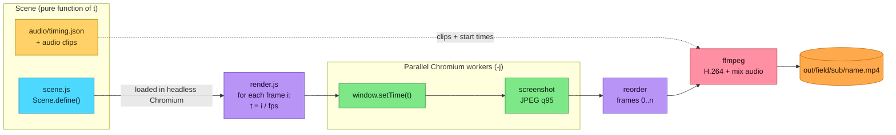
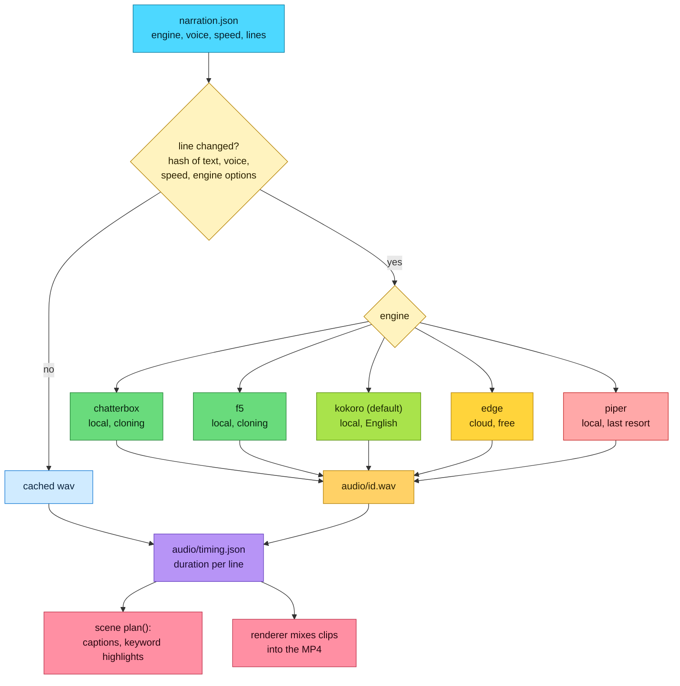
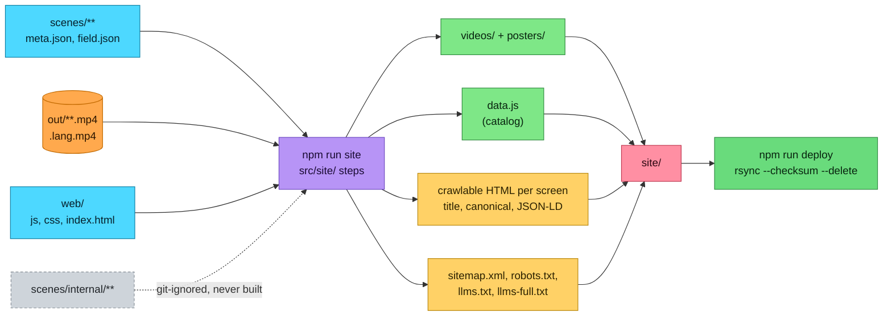
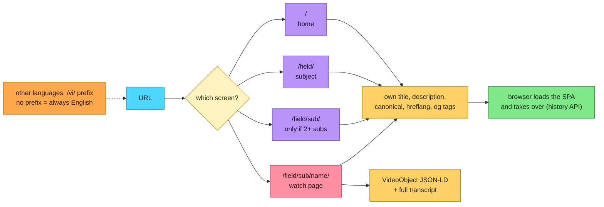

# web-animation-to-video

Turn web animations (canvas, SVG, DOM, CSS keyframes) into MP4 videos.

Instead of screen-recording, the renderer drives headless Chromium **frame by frame**:
for each frame it calls `window.setTime(t)`, takes a screenshot, and pipes it to ffmpeg.
Output is deterministic, never drops frames, and renders at any resolution/fps.

## How it works



Because every frame is derived from `t` alone, workers can render frames in any order and the result is identical on every run.

## Quick start

```bash
npm install
npm run setup                 # downloads Chromium for Playwright (once)
npm run dev                   # live preview with scrubber: http://localhost:5173
npm run make -- electricity   # narrate + render -> out/physics/electricity-basics/electricity.mp4
```

Prefer to let Claude do it? Install the [Claude Code skill](#claude-code-skill) and ask for a video on any topic.

Scenes are organised by field (subject) and sub-category: `scenes/<field>/<sub>/<name>/` and the video goes to
`out/<field>/<sub>/<name>.mp4`. Any unique tail of the id works: `electricity`, `electricity-basics/electricity`.

```bash
npm run make -- --all                 # narrate + render every scene
npm run make -- --field biology       # every scene in one field
npm run make -- --sub how-ai-works    # every scene in a sub-category
npm run make -- biology/energy-in-cells/respiration   # one scene
```

Render a scene without narrating:

```bash
npm run render -- <field>/<sub>/<name> [--fps 60] [--width 1280] [-j 8] [--crf 18] [--audio narration.mp3] [-o out/x.mp4]
```

Check a scene's layout and timing quickly with `npm run preview -- <scene> [seconds]`: it renders a low-res silent copy and writes a contact sheet to `out/preview/<name>.png`.

Frames render in parallel (`-j/--workers`, default about half your cores) and are written to ffmpeg in order. Frames travel as JPEG (quality 95); PNG encoding was ~13x slower (electricity example: 130s -> 10s).

ffmpeg is bundled through `ffmpeg-static`; nothing to install system-wide.

## Narration (text to speech)

Local, free, no API key. The default engine is [Kokoro](https://github.com/hexgrad/kokoro) via `kokoro-js` (model downloads once, ~90MB); Chatterbox, F5-TTS and others are below.

```bash
npm run narrate -- electricity   # narration.json -> audio/*.wav + audio/timing.json
npm run render -- electricity    # scene times itself to the speech; the renderer mixes the clips in
```



`narration.json` holds the voice, speed and one text line per id; unchanged lines are cached. The scene reads
`audio/timing.json` to time its captions (and highlight keywords as they are spoken) and declares its clips with
`Scene.define({ audio: [{ src, start }] })`, which the renderer mixes into the MP4. Without `timing.json` the scene
renders silently with fixed hold times. `audio/` is git-ignored (generated, ~160 MB for all scenes), so run `npm run narrate -- <scene>` (or `make`) after cloning. The browser preview (`npm run dev`) has no sound.

### Other languages (Vietnamese)

```bash
npm run narrate -- electricity --lang vi   # narration.vi.json -> audio/vi/ (edge-tts, auto-installed)
npm run render  -- electricity --lang vi   # -> out/physics/electricity-basics/electricity.vi.mp4
```

Set `"engine"` in `narration.json` (preferred first): `chatterbox` (very natural, optional voice cloning, English; add `"ref": "audio/ref.wav"`,
`"exaggeration"`, `"cfg"`), `f5` (zero-shot voice cloning; `"ref"`, `"refText"`, `"model"`), `kokoro` (default, English only), `edge` (Microsoft
neural voices via `edge-tts`, free, text is sent to Microsoft; used for Vietnamese with `"voice": "vi-VN-HoaiMyNeural"`) or `piper` (fully
local, but flat-sounding: the last resort). Chatterbox and F5 install into their own Python 3.11 venv on first use (via `uv`, ~GBs of torch)
and run best on a GPU / Apple Silicon. The scene switches its on-screen text on `LANG` from `runtime/kit.js`.

## Claude Code skill

`skills/create-illustration-video/` is a [Claude Code](https://claude.com/claude-code) skill that makes a video for a topic end to end (plan, scaffold,
narration, scene, preview check, render). Install it once so it works from any directory:

```bash
npm run skill:install                  # copies it to ~/.claude/skills/create-illustration-video (--uninstall to remove, --dest <dir> to change the target)
```

Then ask Claude Code, e.g. *"create an illustration video about how DNS works"* (or *"... as an internal video"* to put it under
`scenes/internal/`), or invoke it directly with `/create-illustration-video`. Edit the skill in `skills/`, then re-run the install.

```mermaid
flowchart LR
    ASK["you: topic"]:::ask --> PL["1 plan<br/>id, chapters,<br/>what each shows"]:::plan
    PL --> SC["2 scaffold<br/>npm run new<br/>+ meta.json"]:::scaffold
    SC --> NA["3 narration.json<br/>short lines first"]:::narr
    NA --> SN["4 scene.js<br/>kit.js helpers,<br/>pure function of t"]:::scene
    SN --> PV["5 narrate + preview<br/>look at the contact sheet"]:::check
    PV -->|overlap, off-screen,<br/>gaps| SN
    PV -->|clean| MK["6 npm run make<br/>out/.../name.mp4"]:::out

    classDef ask fill:#4dd8ff,stroke:#0a7ea4,color:#06202b
    classDef plan fill:#b794f6,stroke:#6b46c1,color:#1a0b33
    classDef scaffold fill:#ffd166,stroke:#b8860b,color:#2b2100
    classDef narr fill:#ffa94d,stroke:#c26a00,color:#2b1600
    classDef scene fill:#7ee787,stroke:#2e8b3d,color:#08240f
    classDef check fill:#ff8fa3,stroke:#c0364f,color:#2b0610
    classDef out fill:#69db7c,stroke:#2b8a3e,color:#08240f
```



## Writing a scene

Copy `scenes/_template/` to `scenes/<field>/<sub>/<name>/`. A scene is a **pure function of time**:

```js
Scene.define({
  width: 1920, height: 1080, duration: 10, background: '#0b1020',
  init({ stage, ctx }) { return { /* state built once */ }; },
  draw(ctx, t, state)  { /* canvas 2D: draw the picture for time t */ },
  update(t, state)     { /* or manipulate DOM / SVG for time t */ },
});
```

Rules for determinism:

- Derive everything from `t`; don't use `Date.now()`, `requestAnimationFrame` or `Math.random()` (use `Scene.rng(seed)`).
- CSS animations/transitions and Web Animations are seeked to `t` automatically.
- Fonts: the electricity scene loads IBM Plex from `@fontsource` via `FontFace` before calling `Scene.define`, so the renderer waits for them.
- Load assets (fonts, images) from local files; the page must be ready before `Scene.define` resolves `document.fonts.ready`.

Helpers on `Scene`: `clamp, lerp, range(t,a,b), easeInOut, easeOut, fadeWindow(t,a,b,fadeIn,fadeOut), rng(seed)`.

## Video library website

```bash
npm run site          # copies videos from out/, makes posters, writes site/data.js
npm run site:serve    # http://localhost:5180
```



Language variants (`<name>.<lang>.mp4`) appear automatically: the page gets an EN/VI switcher, and a language only lists videos rendered in it. Translate the text with a `"vi": { "title": ..., "summary": ..., "tags": [...], "series": ... }` block in `meta.json` (and `title`/`blurb` in `field.json`).

The hand-written site source is in `web/` (`js/`, `style.css`, `brand/`, `index.html` template); `npm run site` builds it into `site/`, which is pure output (git-ignored). `site/` is a static site (open `site/index.html` directly, or upload the folder to any static host). Videos are grouped by
subject, then by series. The text comes from `scenes/<field>/field.json` (subject title, blurb, colour) and
`scenes/<field>/<sub>/<name>/meta.json` (title, summary, tags, series, order). The `<sub>` folder is the sub-category: selecting a subject
on the site shows its sub-categories as filter chips (named by `series`). A scene without a rendered video is skipped, and
one without `meta.json` still appears with a title made from its folder name.

### SEO and link previews

The app is an SPA, but `npm run site` also writes real HTML for every screen, so crawlers and link previews see content:



Pages come from the `web/index.html` template (`<!--SEO-->`, `<!--H1-->`, `<!--MAIN-->` markers; asset paths stay absolute). Also generated:
`sitemap.xml` (with hreflang and video entries), `robots.txt`, `llms.txt` and `llms-full.txt` (all transcripts). The player's **Copy link**
button copies the video's own URL. Absolute URLs need your site's public origin: copy `.env.example` to `.env` and set `SITE_URL`
(git-ignored); without it canonical, og, JSON-LD and the sitemap are omitted. The link-preview image is `web/brand/og.png` (regenerate with `npm run og`).

### Internal scenes

Scenes under `scenes/internal/<sub>/<name>/` work like any other (`dev`, `narrate`, `render`, `preview`) but are git-ignored and skipped by
the site build, so they never reach `site/` or the server. Scaffold one with `npm run new -- internal/<sub>/<name> "Title"`.

## Layout

```
web/                 site source: js/ (ES modules), style.css, brand/, index.html template
runtime/scene.js     scene API + live preview UI
runtime/kit.js       shared palette, fonts, canvas helpers, narrated keyword captions
src/render.js        Playwright -> ffmpeg renderer
src/narrate.js       text-to-speech (engines in src/narrate/engines/: chatterbox, f5, kokoro, edge, piper)
src/narrate/         engines/ (one module per TTS engine), py/ (Chatterbox and F5 scripts), python.js (venvs), wav.js
src/make.js          narrate + render several scenes
src/server.js        static server + scene discovery (used by dev and render)
src/site.js          builds the video library website in site/ (steps in src/site/)
src/preview.js       low-res render + contact sheet for checking a scene
src/og-image.js      regenerates the site's link-preview image
scenes/<field>/<sub>/<name>/   index.html, scene.js, narration.json, audio/
scenes/_template/    starting point for new scenes
skills/              Claude Code skills (create-illustration-video), installed by npm run skill:install
scenes/internal/     internal scenes: git-ignored, not on the site
out/<field>/<sub>/<name>.mp4

fields / sub-categories so far
  physics            electricity-basics: electricity, copper
  computer-science   how-ai-works: ai, attention, parameters, backpropagation, training-pipeline, temperature,
                       diffusion, rag, hallucination, context-window, agents, bias, overfitting
                     grade-9-data-transmission: packet-switching, transmission-modes, serial-parallel,
                       error-detection, parity, check-digits, encryption, quiz
                     behind-the-scenes: web-to-video (how this project makes its videos), browser-rendering,
                       url-to-page (URL to full page: DNS, TLS, CDN, Go API)
  biology            energy-in-cells: respiration, photosynthesis
  software-engineering  scrum: why-scrum, empirical-process, why-sprints, roles-and-events, scrum-vs-kanban
                     backend-runtimes: why-go, why-java, why-nodejs
                     message-brokers: why-rabbitmq, why-kafka
                     in-memory-stores: why-redis, redis-vs-valkey
                     containers: why-docker, why-kubernetes
                     kubernetes-internals: control-plane, etcd, scheduler, controllers
                     ai-coding: context-mode, cut-token-usage, headroom
  economics          money-and-rates: what-is-money, money-and-gold, exchange-rates, fed-rate-hikes, who-controls-money
```

New scene: `npm run new -- <field>/<sub>/<name> "Title"` copies the template (new fields and sub-categories are just new folders). Edit
`narration.json` and `scene.js`, then `npm run make -- <field>/<sub>/<name>`. `runtime/kit.js` has `plan()` (timeline from the
narration), `mount()`, `titleCard()` and drawing helpers, so a scene is mostly its own drawing code.
